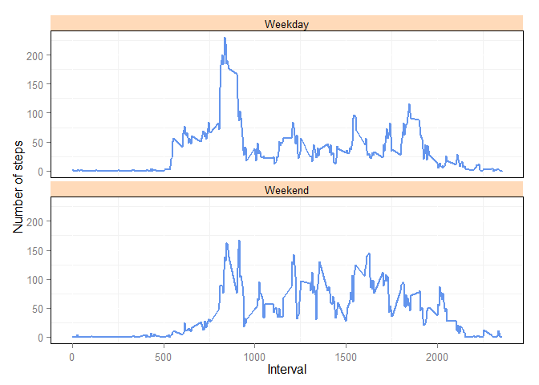

# Reproducible Research: Peer Assessment 1
Maarten Caminada  
Tuesday, November 11, 2014  

## Changing the work directory and loading the packages needed


```r
wd <- "c:/maca/Rdata/RepData_PeerAssessment1" #the directory where I unzipped the datafiles
setwd(wd) #is now my working directory

Sys.setlocale("LC_TIME", "C") # change timesettings to English
```

```
## [1] "C"
```

```r
library(knitr) #load knitr, assuming the package is installed
library(markdown) # dito for markdown, and the other packages
library(plyr)
library(lubridate)
```

```
## 
## Attaching package: 'lubridate'
## 
## The following object is masked from 'package:plyr':
## 
##     here
```

```r
library(ggplot2)
options(scipen = 3) #no scientific notation
```

## Loading and preprocessing the data


```r
activity <- read.csv("activity.csv") 
act_cc <- activity[complete.cases(activity),] #only use the rows without missing values
```

## What is mean total number of steps taken per day?


```r
totals <- ddply(act_cc, .(date), summarize, steps=sum(steps))
hist(totals$steps)
```

 

```r
meansteps <- mean(totals$steps)
mediansteps <- median(totals$steps)
```

The mean number of steps is 10766.1886792. The median number of steps is 10765.

## What is the average daily activity pattern?


```r
interval <- ddply(act_cc, ~interval, summarise, mean = mean(steps)) #get the averages per interval
plot(ddply(act_cc, ~interval, summarise, mean = mean(steps)), type = "l") #time series plot of 5-minute interval
```

 

```r
maxsteps <- interval$interval[interval$mean==max(interval$mean)] #which interval contains the max number of steps
```

The interval with the max number of steps is 835.

## Imputing missing values


```r
## I want to use the average for that 5-minute interval to replace NAs 
NAs <- nrow(activity) - nrow(act_cc) #the number of rows with NAs
act_all <- merge(activity, interval, by ="interval")
act_all$steps[is.na(act_all$steps)] <- act_all$mean[is.na(act_all$steps)]
act_all$mean <- NULL
meanstepsall <- mean(act_all$steps)
medianstepsall <- median(act_all$steps)
```

The number of rows that contain NAs is 2304. 
The mean number of steps for the dataset where the missing data is filled in is 37.3825996. 
The median number for this dataset is 0.

## Are there differences in activity patterns between weekdays and weekends?


```r
act_all$date <- as.Date(as.character(act_all$date), format='%Y-%m-%d')
act_all$weekday <- weekdays(act_all$date)
act_all$weekday[act_all$weekday == "Saturday" | act_all$weekday =="Sunday"] <- "Weekend"
act_all$weekday[act_all$weekday != "Weekend"] <- "Weekday"

act_all_mean <- ddply(act_all, c("interval", "weekday"), summarise, mean = mean(steps))

plotweekdays <- ggplot(act_all_mean , aes(x=interval, y=mean))+
        geom_line(colour="cornflowerblue", size = 0.75)+
        theme(panel.background = element_blank(),
             panel.border= element_rect(fill=NA, colour ="black", size = 0.5, linetype="solid"))+
        facet_wrap(~weekday, ncol = 1)+
        theme(strip.background = element_rect(fill="peachpuff"))+
        labs(x= "Interval", y = "Number of steps")       
print(plotweekdays)
```

 

```r
meandiff  <- meansteps - meanstepsall
mediandiff <- mediansteps - medianstepsall
```

The difference between the mean of the first and second dataset is 10728.8060797.
The difference between the median of the first and second dataset is 10765.
